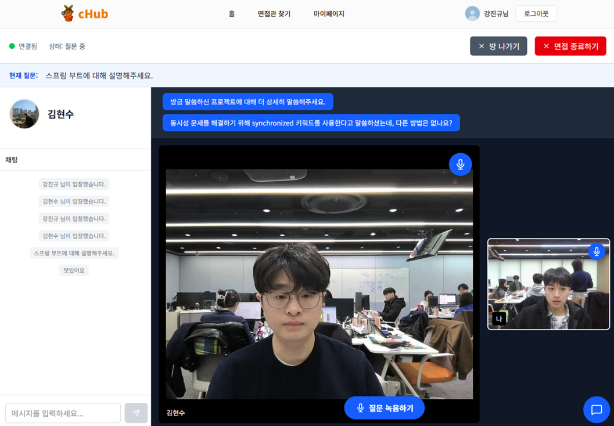
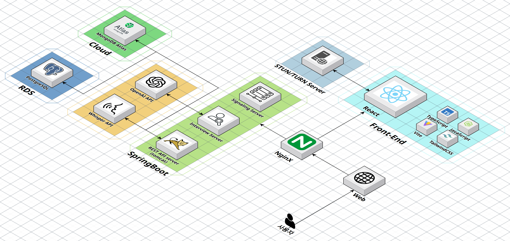

## 🗂️ 팀 문서 & 자료 링크

  <a href="https://www.notion.so/chub-288656e282d880bd8f9eea69aef68157">📒 팀 노션</a>&nbsp;

 
 

## 🧑‍💻 역할 및 기여

|담당자| 주요 작업|
|----------|---------------------------------------------------------------------------------------------------------------------------------------------------------------------------------------------------------------------------------------------------------------------------------------------------------------------------------------------------------------------------------------------------------------------------------------------------------------------------------------------------------------------------------------------------------------------------------------------------------|
| **유윤지**  | - 이력서 관리 API 구현 (Base64 방식) - 이력서 관리 API 구현 V2 (파일 시스템 기반) - MultipartFile을 활용한 PDF 파일 업로드 및 저장 로직 구현  - 이력서 PDF 미리보기 기능 개발 (URL 기반 접근) - 기존 파일 자동 삭제 및 덮어쓰기 로직 구현 - 면접관 프로필 생성 및 수정 API 개발 - Base64 인코딩 방식에서 파일 시스템 방식으로 마이그레이션하여 성능 최적화|
| **강진규**  |- 면접 대시보드 및 세션 관리 구현으로 신청/신청받음/예정/완료 통계 및 역할별 구분 제공   - WebRTC 시그널링 서버를 통한 P2P 영상 통화 신호 중개 및 ICE 처리   - HTTP/WebSocket 기반 실시간 면접 진행 로직 및 네트워크 재연결 자동 복구  - WebSocket 기반 면접방 실시간 채팅 시스템 구현  - STT 및 AI 꼬리질문 연동으로 면접 자동화 및 기록 저장/조회 API 개발  - Swagger 통합 API 문서화 및 계층별 단위 테스트 작성(TDD) |
| **김현수**  | - 실시간 채팅 시스템 (MongoDB + WebSocket) 설계 및 구현  - MongoDB 복합 인덱스를 활용한 메시지 정렬 최적화 - 읽음/안읽음 추적 기능 구현 (Lazy Loading 방식)  - 사용자 조회시간, 새 메시지 등록시간, 안읽음 카운트 시간 기반 캐싱 전략으로 성능 최적화  - WebSocket 기반 읽음 상태 실시간 동기화 - 커서 기반 페이지네이션 설계 (실시간 메시지 조회 최적화) - 백엔드 계층별 단위 테스트 코드 작성(TDD) |
| **김형진**  |- react query를 통한 면접관 목록 페이지 필터링/페이지네이션 제공  - Zustand 상태 관리를 통한 면접관 목록 필터링 및 API 연동  - WebSocket 기반 실시간 채팅, ICE Candidate 관리, 메시지 송수신 구현 - 오디오 레코딩 및 STT 연동으로 질문/답변 음성 기반 입력 및 오디오 제어 UI 개발 -WebRTC를 통한 화상 통화 구현  - 개인별 실시간 채팅 및 WebSocket 구독/취소 관리 -Vitest, RTL을 통한 컴포넌트 단위 테스트 작성(TDD) |
| **배수한**  | - Docker, Jenkins기반 CI/CD 파이프라인 구축 및 최적화 - 면접관/면접신청 관리 API 구현 - 카카오 OAuth2 및 JWT 토큰 기반 인증 - WebRTC 시그널링 서버 구현 및 P2P 연결 관리 - 개발자 포털용 내부 전용 API 설계 및 구현 - 각 컨트롤러, 서비스, 리포지토리 단위 테스트 코드 작성(TDD)|

 
 

## 👋 프로젝트 소개

### 📊 *"면접관-취준생 모의 면접 매칭 플랫폼"*

**Chub**는 면접관과 취준생을 연결하여,
**실제 면접과 같은 경험**을 제공하는 **모의 면접 플랫폼**입니다.

- **WebRTC 기반 영상/음성 통화**와 **실시간 채팅**으로 생생한 면접 환경을 제공해요.
- **비휘발성 실시간 채팅**으로 면접 일정을 정하거나 면접 조언을 주고받을 수 있어요.
- **이력서 업로드 및 관리** 기능으로 효율적인 면접 준비가 가능해요.
- **STT로 변환된 질문 & 답변을 저장**하여 나중에 면접을 복기할 수 있어요.
- **Kakao OAuth2 인증**으로 안전하고 간편하게 로그인할 수 있어요.

## 🧩 **고민과 해결 방안**

### 🚀 **프론트**

### 🛡️ **백**
### 🔄 **WebSocket 재연결 전략으로 안정적인 면접 환경 구축**

실시간 면접 시스템에서 네트워크 불안정이나 브라우저 강제 종료로 인한 WebSocket 연결 끊김은 치명적인 문제였습니다. 연결이 끊어지면 진행 중인 면접이 중단되고, 사용자는 처음부터 다시 시작해야 하는 상황이 발생할 수 있었습니다.

전통적인 heartbeat나 ping/pong 방식은 지속적인 메시지 교환으로 인한 오버헤드가 발생했고, 우리 서비스의 특성상 대부분의 이벤트가 broadcast되어 즉각적인 연결 끊김 감지가 어려웠습니다.

이를 해결하기 위해 **"마지막 이벤트 재발송"** 전략을 도입했습니다. 각 사용자별로 마지막 발생 이벤트를 메모리에 저장하고, 재연결 시 해당 이벤트를 재전송하여 끊어진 지점부터 자연스럽게 이어갈 수 있도록 구현했습니다.

JWT 기반 사용자 인증과 userId 매핑을 통해 재연결 시 이전 세션 상태를 정확히 복구할 수 있었고, 연결 상태 모니터링 오버헤드 없이도 빠른 재연결이 가능한 안정적인 면접 환경을 구축했습니다.

[Wiki로 자세히 보기](https://lab.ssafy.com/s13-fintech-finance-sub1/S13P21A508/-/wikis/%F0%9F%9A%80-%EC%8B%9C%EA%B3%84%EC%97%B4-%EB%8D%B0%EC%9D%B4%ED%84%B0-%EC%A1%B0%ED%9A%8C-%EC%84%B1%EB%8A%A5-%EC%B5%9C%EC%A0%81%ED%99%94)
 

### 🔄 **이중 타임스탬프 캐싱 전략을 통한 채팅 미읽음 조회 속도 개선**

실시간 채팅 시스템에서 읽음/안읽음 상태를 정확히 추적하는 것은 사용자 경험의 핵심입니다. 

채팅방 목록 조회할 때마다 안읽은 메시지를 카운트하거나, 메시지 전송 시 미읽음 카운트를 증가시키고 사용자가 메시지를 읽을 때마다 카운트를 초기화하며, 메모리에만 저장해 성능 저하와 동시성 문제를 야기했습니다.

이를 해결하기 위해 **이중 타임스탬프 캐싱 전략**을 도입했습니다. `안읽은 메시지 수`, `마지막 읽음 시간`, `마지막 계산 시간`, `마지막 메시지 생성 시간` 필드를 통해 읽음 상태를 추적하고, 계산 시간과 메시지 생성 시간을 비교해 불필요한 재계산을 방지합니다.

이를 통해 MongoDB 원자적 업데이트로 동시 접근 시 데이터 일관성을 보장하고, countedAt 체크로 불필요한 DB 쿼리를 스킵하여 채팅방 목록 조회를 O(1)의 시간 복잡도로 개선했습니다.

[Wiki로 자세히 보기](https://lab.ssafy.com/s13-final/S13P31A707/-/wikis/Lazy-Loading-%EA%B8%B0%EB%B0%98-%EB%AF%B8%EC%9D%BD%EC%9D%8C-%EC%B6%94%EC%A0%81%EC%9C%BC%EB%A1%9C-%EB%B9%A0%EB%A5%B8-%EC%B1%84%ED%8C%85-%ED%99%98%EA%B2%BD-%EA%B5%AC%EC%B6%95)
 

 
 

## 🎯 주요 기능 소개

### 🎥 면접 진행 & STT 기반 기록
> **"모든 질문과 답변을 자동으로 저장해요!"**

**WebRTC 화상통화**로 실제 면접과 동일한 환경을 제공하며,  
**STT(Speech-to-Text) 기능**으로 음성 질문과 답변을 **자동으로 텍스트로 변환**합니다.  
**변환된 질문 & 답변을 저장**하여 면접 후 언제든지 복기하고 자신의 답변을 분석할 수 있어요.

### 💬 실시간 채팅 시스템
> **"면접 중에도, 면접 전후로도 소통할 수 있어요!"**

**WebSocket 기반 실시간 채팅**으로 면접 진행 중 **참여자들이 즉시 소통**할 수 있습니다.  
**NoSQL 기반 비휘발성 채팅**으로 면접 전후에도 **지속적인 커뮤니케이션**을 지원하며,  
**읽음/안읽음 추적** 기능으로 메시지 상태를 파악할 수 있어요.

  

 

### 💼 면접관 프로필 & 이력서 관리
> **"체계적인 프로필 관리로 최적의 매칭을!"**

**면접관의 상세 프로필 정보** (회사, 직급, 경력, 부서, 전문분야, 가능한 시간대)를 관리하고,
**분야별 검색 & 필터링**으로 최적의 면접관을 찾을 수 있습니다.
**취준생의 이력서** (PDF 업로드, 자동 파일 저장 및 검증)를 효율적으로 관리해요.

  

### 🔐 카카오 소셜 로그인
> **"간편하고 안전한 로그인!"**

**카카오 OAuth2 연동**으로 복잡한 회원가입 절차 없이 원클릭으로 빠른 로그인이 가능합니다.
JWT 토큰 기반 인증으로 보안성을 보장하며, 리프레시 토큰을 통해 안정적인 세션 관리를 제공해요.

  

## ✅ 서비스 구조도

 
 

## ⚒️ Tech Stacks

| 분류 | 기술 스택                                                                                              |
|------|----------------------------------------------------------------------------------------------------|
| **Frontend** |  |
| **Backend** |        |
| **Database / Infra** |     |
| **배포** |               |
| **협업 / 개발도구** |       |

 
 

## 🤼 팀원 소개

|유윤지|강진규|김현수|김형진|배수한|
|:---:|:---:|:---:|:---:|:---:|
|  |   |  |   |   |
|**Backend**|**Backend**|**Backend**|**Frontend**|**Backend**|
|[@llcodingll](https://github.com/llcodingll)|[@jin0410](https://github.com/jin0410)|[@hanskim431](https://github.com/hanskim431)|[@hyeongjin-kim](https://github.com/hyeongjin-kim)|[@SwnBae](https://github.com/SwnBae)|